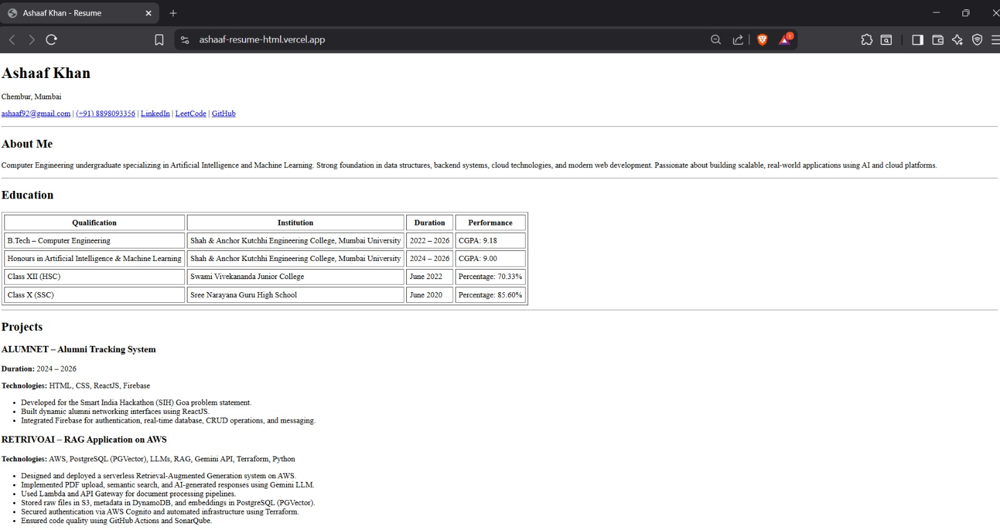

# Resume HTML

A single-page resume website built using **pure HTML**, focusing on semantic structure, readability, and clean layout without using CSS.

---

## 🚀 Live Demo
🔗 https://ashaaf-resume-html.vercel.app/

---

## 📸 Preview

---

## 🛠️ Technologies Used
- HTML5
- Semantic HTML tags
- Tables & Lists (no CSS)

---

## 📂 Project Features
- Clean and structured resume layout
- Proper use of headings, sections, tables, and lists
- No external libraries or CSS used
- Fully responsive via browser default rendering

---

## 📦 Deployment
This project is deployed using **Vercel** with automatic redeployment on every GitHub push.

